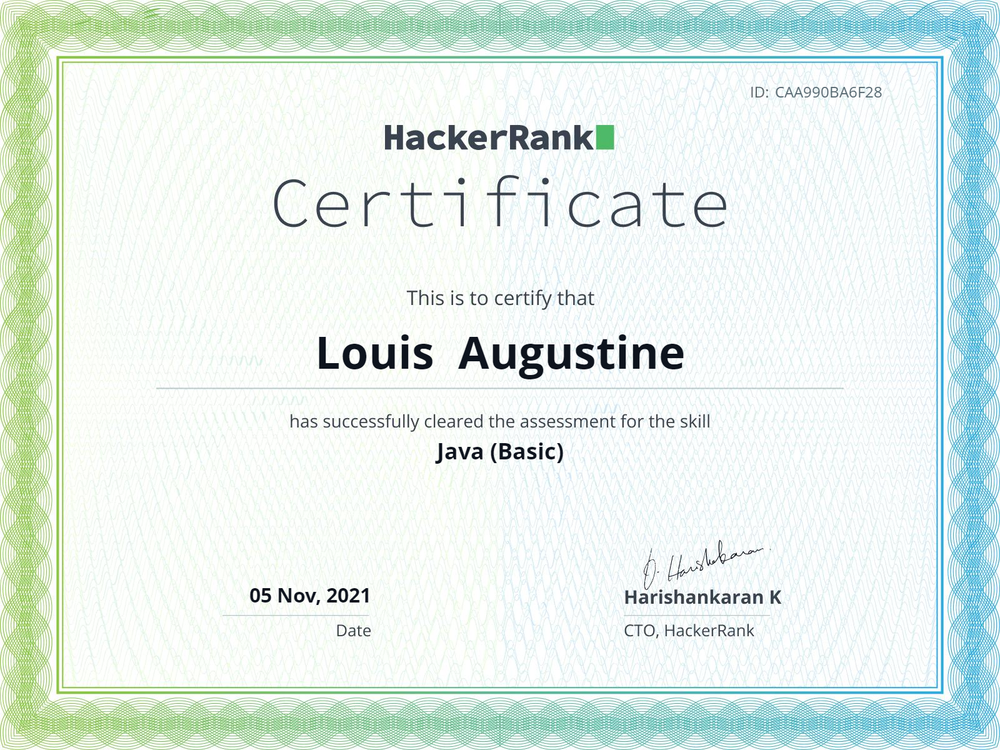

### Welcome 👋

**Louis Lu** is a ✨ _highly competent_ ✨ Software Engineer at Westpac New Zealand.

<i>Follow me:</i> 

---

Here are some ideas to get you started:

- 🔭 I’m currently in New Zealand ...
- 🌱 I’m currently learning Java, React, Python, and AWS ...
- 😄 I’m developing some awesome projects ... https://books.nzlouis.com

- 💬 I’m hoping to talk with you ...          https://www.linkedin.com/in/ailouis

- 📫 How to reach me: …                       https://nzlouis.com

---

# Skilled In Technology

# Certificates

